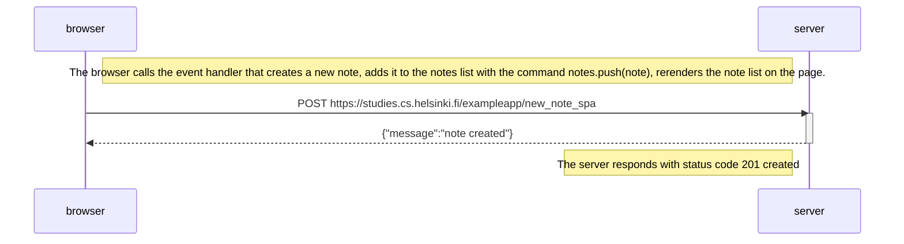

```mermaid
sequenceDiagram
    participant browser
    participant server

    Note right of browser:The browser calls the event handler that creates a new note, adds it to the notes list with the command notes.push(note), rerenders the note list on the page.
    browser->>server: POST https://studies.cs.helsinki.fi/exampleapp/new_note_spa
    activate server
    server-->>browser: {"message":"note created"}
    deactivate server
    Note left of server:The server responds with status code 201 created
```